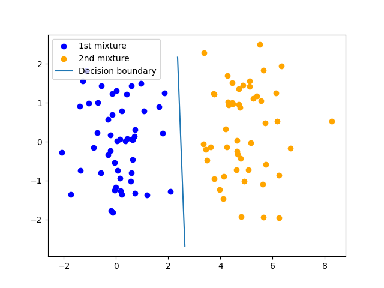

# Probabilistic Generative Model for mixture-of-Gaussian

The repository contains the code for probabilistic generative model for mixture-of-gaussian classification



## How to run
1) Install the Python modules using the ```requirements.txt```
2) Run the Jupyter Notebook